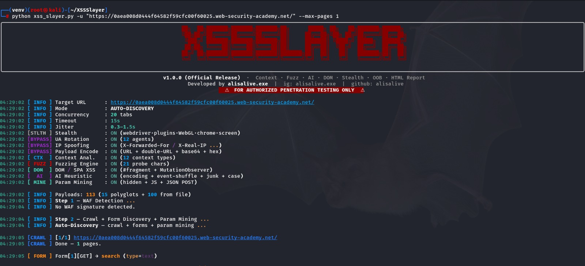
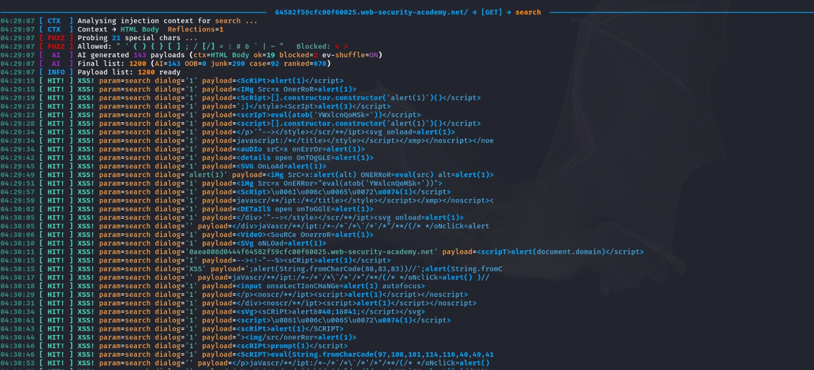
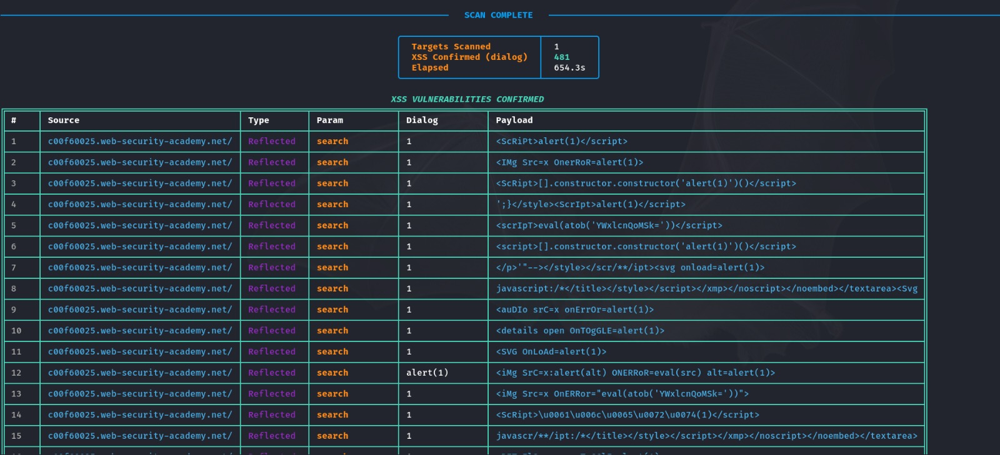

```
██╗  ██╗███████╗███████╗    ███████╗██╗      █████╗ ██╗   ██╗███████╗██████╗
╚██╗██╔╝██╔════╝██╔════╝    ██╔════╝██║     ██╔══██╗╚██╗ ██╔╝██╔════╝██╔══██╗
 ╚███╔╝ ███████╗███████╗    ███████╗██║     ███████║ ╚████╔╝ █████╗  ██████╔╝
 ██╔██╗ ╚════██║╚════██║    ╚════██║██║     ██╔══██║  ╚██╔╝  ██╔══╝  ██╔══██╗
██╔╝ ██╗███████║███████║    ███████║███████╗██║  ██║   ██║   ███████╗██║  ██║
╚═╝  ╚═╝╚══════╝╚══════╝    ╚══════╝╚══════╝╚═╝  ╚═╝   ╚═╝   ╚══════╝╚═╝  ╚═╝
```

**The Ultimate XSS Hunter — Context-Aware · AI Heuristic · DOM/SPA · Stealth · OOB**

---

<div align="center">


</div>

---

## What is XSSSlayer?

XSSSlayer is a real-browser XSS scanner built on Python asyncio and Microsoft Playwright. Unlike regex-based tools, XSSSlayer actually executes JavaScript inside a full Chromium instance — making it 100% accurate with zero false positives.
Every finding is confirmed by a real `alert()` / `confirm()` / `prompt()` dialog caught by the browser's native event system, not by string matching.

---

## Interface & Deep Analysis

<div align="center">

<table>
  <tr>
    <td align="center" width="32%">
      
      <br/>
      <em>Clean CLI launch with target config — get scanning in seconds.</em>
    </td>
    <td align="center" width="32%">
      
      <br/>
      <em>Live payload injection feed — context detection and WAF bypass in real time.</em>
    </td>
    <td align="center" width="32%">
      
      <br/>
      <em>Dark-theme HTML report with confirmed XSS hits, risk levels and screenshots.</em>
    </td>
  </tr>
</table>

</div>

---

## Features

| Category | Capabilities |
|---|---|
| Detection Engine | Dialog-only XSS confirmation (0 false positives), DOM XSS via MutationObserver, URL fragment (#) SPA testing |
| Context Analysis | 12 injection contexts: HTML_BODY, ATTR_DQ/SQ/BARE, SCRIPT_STRING, COMMENT, STYLE, and more |
| Fuzzing Engine | 22-char batch probe, allowed/blocked char analysis, context-escape prefix generation |
| AI Heuristic | Generates novel payloads on-the-fly based on char allowlist from fuzz results |
| WAF Bypass | Random UA rotation, X-Forwarded-For spoofing, 403/429 backoff, double URL encode, base64 `eval(atob())`, hex `\xNN`, unicode `\uNNNN`, comment junk (`scr/**/ipt`), case randomizer (`OnErRoR`) |
| Stealth | Playwright fingerprint masking: `navigator.webdriver`, `hardwareConcurrency`, WebGL, plugins, chrome object, screen dimensions |
| Auto-Discovery | Automatic form/input discovery, parameter mining (hidden inputs, JS hints, JSON body), BFS same-origin crawler |
| Blind / OOB XSS | `--xss-report` injects callback URLs for out-of-band detection |
| Output | Dark-theme HTML report with risk levels, screenshots, elapsed time, payload detail |
| Session Support | `--cookie` for authenticated panel testing |
| Proxy Support | `--proxy` for Burp Suite integration |

---

## Quick Start

### Linux / Kali (One-Shot Setup)

```bash
git clone https://github.com/alisalive/XSSSlayer.git
cd XSSSlayer
chmod +x setup_kali.sh
./setup_kali.sh
```

`setup_kali.sh` installs all system dependencies, creates the venv, installs Python packages, and registers `xssslayer` as a global command at `/usr/local/bin/xssslayer`.

**After setup, use directly from any directory:**

```bash
xssslayer -u "https://target.com"
xssslayer -u "https://target.com" --max-pages 60 --screenshot
xssslayer -u "https://target.com/search?q=x" -p q --show-browser
xssslayer --help
```

### Windows (Git Bash)

```bash
git clone https://github.com/alisalive/XSSSlayer.git
cd XSSSlayer
python -m venv venv
venv/Scripts/pip install -r requirements.txt
venv/Scripts/python -m playwright install chromium
venv/Scripts/pip install -e .
```

This registers `xssslayer` inside the venv. For system-wide access without activating the venv, add the global wrapper to your PATH:

```bash
# Run once — makes xssslayer available from any Git Bash terminal
mkdir -p ~/bin
cat > ~/bin/xssslayer <<'EOF'
#!/usr/bin/env bash
SCRIPT_DIR="/c/Users/User/XSSSlayer"
exec "$SCRIPT_DIR/venv/Scripts/python.exe" "$SCRIPT_DIR/xss_slayer.py" "$@"
EOF
chmod +x ~/bin/xssslayer
```

**After setup, use directly from any directory:**

```bash
xssslayer -u "https://target.com"
xssslayer -u "https://target.com" --max-pages 60 --screenshot
xssslayer --help
```

---

## Power User Guide

### Mode 1 — Single Target (Fast Scan)

Scan one specific parameter on a target URL.

```bash
xssslayer -u "https://target.com/" --max-pages 1
```

### Mode 2 — Full God Mode

Maximum coverage: crawler, screenshots, Burp proxy, OOB callbacks, visible PoC browser, custom concurrency.

```bash
xssslayer -u "https://target.com" \
    --cookie "session=YOUR_TOKEN" \
    --xss-report YOUR_XSS_REPORT_ID \
    --show-browser --screenshot \
    --proxy http://127.0.0.1:8080 \
    --max-pages 60 --timeout 20 \
    --jitter 0.5 2.0 \
    --concurrency 25 \
    -o results.json
```

### Mode 3 — Stealth Mode

Low-and-slow scan with human-like delays to evade WAFs and rate limiters.

```bash
xssslayer -u "https://target.com" \
    --concurrency 3 \
    --jitter 1.5 4.0 \
    --timeout 30
```

### Mode 4 — Authenticated Panel Scan

Pass session cookies to scan protected pages and admin panels.

```bash
xssslayer -u "https://target.com/admin/users?id=1" \
    -p id \
    --cookie "session=abc123; csrf_token=xyz" \
    --screenshot
```

---

## Flag Reference

| Flag | Default | Description |
|---|---|---|
| `-u`, `--url` | Required | Target URL |
| `-p`, `--param` | Auto-Discovery | Parameter to inject. Omit for full auto-discovery |
| `-c`, `--concurrency` | 20 | Max parallel browser tabs |
| `--timeout` | 15 | Navigation timeout in seconds |
| `--jitter MIN MAX` | 0.5 2.0 | Random delay range between requests (seconds) |
| `--max-pages` | 30 | Max pages to crawl in auto-discovery mode |
| `--proxy` | None | HTTP proxy (e.g. `http://127.0.0.1:8080`) |
| `--cookie` | None | Session cookies (`"name=value; name2=value2"`) |
| `--xss-report` | None | Blind/OOB XSS callback ID |
| `--screenshot` | Off | Save PNG screenshots of confirmed XSS |
| `--show-browser` | Off | Open visible browser window on XSS confirmation |
| `--no-mine` | Off | Disable parameter mining |
| `-o`, `--output` | None | Save JSON results to file |

---

## How It Works

```
Target URL
    │
    ├─► BFS Crawler (same-origin, --max-pages)
    │       └─► Form / Input Discovery
    │               └─► Parameter Mining (hidden, JS, JSON)
    │
    ├─► Context Analysis (Batch Fuzz Probe → 12 context types)
    │       └─► Allowed/Blocked char detection
    │
    ├─► Payload Selection
    │       ├─► 15 Universal Polyglots
    │       ├─► Context-Specific Escapes
    │       ├─► AI Heuristic (generated from fuzz results)
    │       └─► 100+ WAF Bypass Encodings
    │
    └─► Real Browser Execution (Playwright Chromium)
            ├─► page.on("dialog") → XSS Confirmed
            ├─► MutationObserver  → DOM XSS Confirmed
            └─► HTML Report + Screenshot (optional)
```

---

## Output

- **Terminal:** Rich-colored live feed with context, WAF status, hit alerts
- **HTML Report:** `results/report_YYYYMMDD_HHMMSS.html` — dark-theme, risk levels, payload detail, screenshot thumbnails
- **JSON:** `-o output.json` for pipeline integration

---

## Requirements

- Python 3.10+
- Chromium (installed automatically via `playwright install chromium`)
- `playwright>=1.44.0`
- `rich>=13.7.1`

---

## Troubleshooting

### Common Issues

**`libasound2` package not found (Kali 2024+ / Ubuntu 24.04+)**

The package was renamed to `libasound2t64` in newer repositories. The updated `setup_kali.sh` handles this automatically. If you run into it manually:

```bash
sudo apt-get install libasound2t64
```

**A system dependency failed to install**

Run Playwright's built-in dependency installer as a backup — it resolves the correct packages for your specific distro:

```bash
sudo python -m playwright install-deps chromium
```

**Brave Browser repository warnings (duplicate sources list)**

If you see warnings like `N: Skipping acquire of configured file ... brave-browser` during `apt-get update`, these are harmless. They come from your Brave browser repository configuration and do not affect XSSSlayer or Playwright in any way.

**`ModuleNotFoundError: No module named 'playwright'`**

You are outside the virtual environment. Activate it first:

```bash
source venv/bin/activate
python xss_slayer.py -u "https://target.com"
```

**Browser launch fails on headless server**

Install Chromium dependencies and ensure you are not running as root without `--no-sandbox`. Use `--show-browser` only on a desktop environment:

```bash
sudo python -m playwright install-deps chromium
```

---

## Legal & Ethics

> For authorized penetration testing and security research only.
> Using this tool against systems without explicit written permission is illegal and unethical. The author assumes no liability for misuse. Always obtain proper authorization before scanning any target.

---

## Support

If XSSSlayer helped you find a bug bounty or level up your security research:

- ⭐ Star this repository
- 🐛 Open an issue for bugs or feature requests
- 🔗 Share it with the community

---

<div align="center">

Developed by **alisalive.exe**

**XSSSlayer v1.0.0 — The Ultimate XSS Hunter**

</div>
